---
## Front matter
title: "Отчёт по лабораторной работе №7"
subtitle: "Дисциплина: архитектура компьютера"
author: "Бондаренко Кристина Антоновна"

## Generic otions
lang: ru-RU
toc-title: "Содержание"

## Bibliography
bibliography: bib/cite.bib
csl: pandoc/csl/gost-r-7-0-5-2008-numeric.csl

## Pdf output format
toc: true # Table of contents
toc-depth: 2
lof: true # List of figures
fontsize: 12pt
linestretch: 1.5
papersize: a4
documentclass: scrreprt
## I18n polyglossia
polyglossia-lang:
  name: russian
  options:
	- spelling=modern
	- babelshorthands=true
polyglossia-otherlangs:
  name: english
## I18n babel
babel-lang: russian
babel-otherlangs: english
## Fonts
mainfont: PT Serif
romanfont: PT Serif
sansfont: PT Sans
monofont: PT Mono
mainfontoptions: Ligatures=TeX
romanfontoptions: Ligatures=TeX
sansfontoptions: Ligatures=TeX,Scale=MatchLowercase
monofontoptions: Scale=MatchLowercase,Scale=0.9
## Biblatex
biblatex: true
biblio-style: "gost-numeric"
biblatexoptions:
  - parentracker=true
  - backend=biber
  - hyperref=auto
  - language=auto
  - autolang=other*
  - citestyle=gost-numeric
## Pandoc-crossref LaTeX customization
figureTitle: "Рис."
listingTitle: "Листинг"
lofTitle: "Список иллюстраций"
lolTitle: "Листинги"
## Misc options
indent: true
header-includes:
  - \usepackage{indentfirst}
  - \usepackage{float} # keep figures where there are in the text
  - \floatplacement{figure}{H} # keep figures where there are in the text
---

# Цель работы

Изучение команд условного и безусловного переходов. Приобретение навыков написания
программ с использованием переходов. Знакомство с назначением и структурой файла
листинга

***

# Выполнение лабораторной работы

С помощью утилиты mkdir создаю директорию lab07, перехожу в нее и создаю файл для работы. (рис. [-@fig:001])

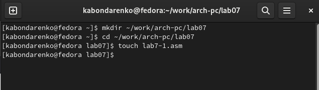{ #fig:001 width=70% }

Открываю созданный файл lab7-1.asm, вставляю в него программу реализации безусловных переходов (рис. [-@fig:002]).

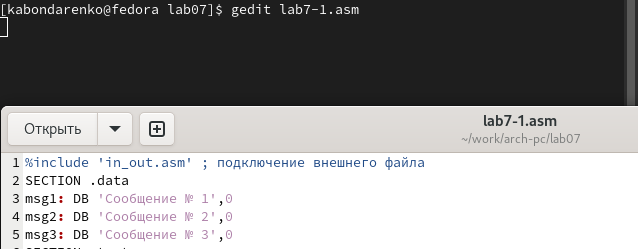{ #fig:002 width=70% }

Создаю исполняемый файл программы и запускаю его.  Инструкции jmp _label2 меняет порядок исполнения инструкций и позволяет выполнить инструкции начиная с метки _label2.(рис. [-@fig:003]).

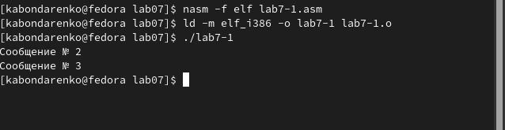{ #fig:003 width=70% }

Изменяю текст программы так, чтобы она выводила сначала ‘Сообщение № 2’, потом ‘Сообщение
№ 1’ и завершала работу. (рис. [-@fig:004]).

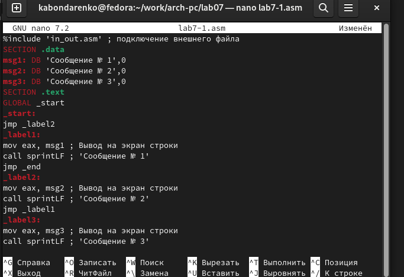{ #fig:004 width=70% }

Создаю новый исполняемый файл программы и запускаю его. Убеждаюсь в том, программа раотает верно.(рис. [-@fig:005]). 

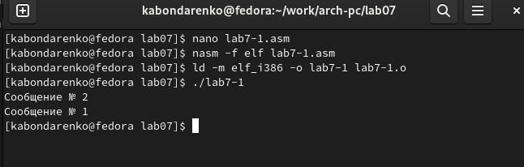{ #fig:005 width=70% }

Изменяю текст программы, так чтобы вывод происходил в обратном порядке (рис. [-@fig:006]).

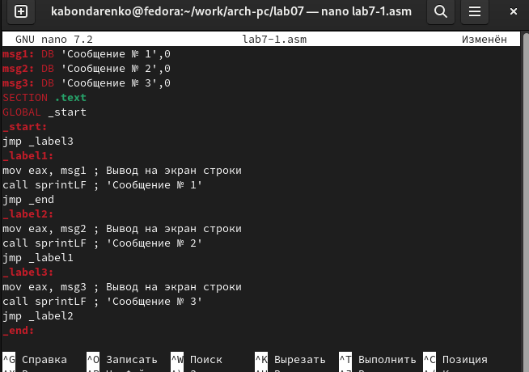{ #fig:006 width=70% }

 Создаю исполняемый файл и проверяю работу программы. Программа отработало верно.(рис. [-@fig:007]).

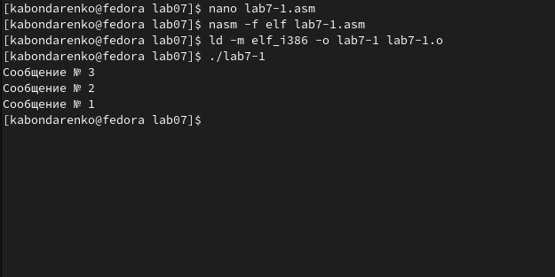{ #fig:007 width=70% }

Создаю новый файл lab7-2.asm для программы с условным оператором.(рис. [-@fig:008]).

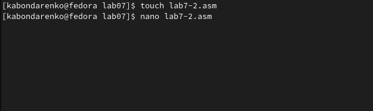{ #fig:008 width=70% } 

Вставляю программу, которая определяет и выводит на экран наибольшее число (рис. [-@fig:009]).

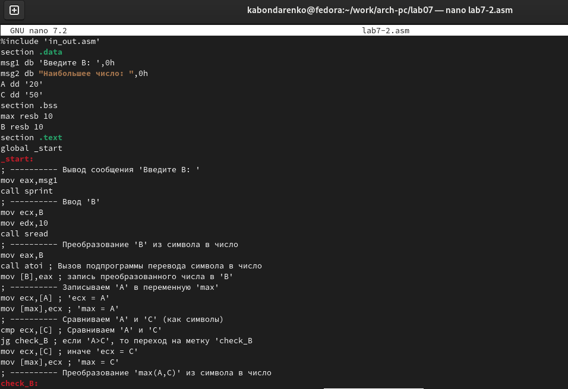{ #fig:009 width=70% }

 Создаю и запускаю новый исполняемый файл, проверяю работу программы для разных B при А=20 и С=50(рис.[-@fig:010]).

{ #fig:010 width=70% }

 Создаю файл листинга для программы в файле lab7-2.asm(рис. [-@fig:011]). 

{ #fig:011 width=70% }

 Открываю файл листинга с помощью редактора mcedit. Расмотрим 9-11 строки:(рис. [-@fig:012]).

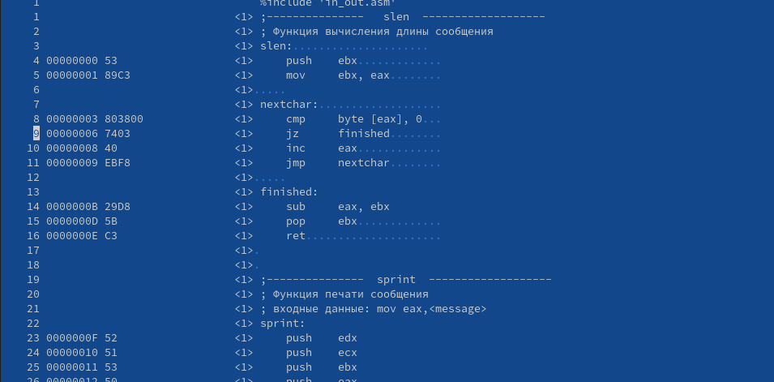{ #fig:012 width=70% }

***

9 строка:

 - Перые цифры [9] - это номер строки файла листинга.
 - Cледующие цифры [00000006] адрес — это смещение машинного кода от начала текущего сегмента, состоит из 8 чисел.
- следующие числа [7403] - это машинный код, который представляет собой ассемблированную исходную строку в виде шестнадцатеричной последовательности, поэтоу и появляются буквы латынского алфавита.
- следющее [jz finished] - исходный текст программы, которая просто состоит из строкк исходной программы вместе с комментариями.

10 строка:

 - Перые цифры [10] - это номер строки файла листинга.
 - Cледующие цифры [00000008] адрес — это смещение машинного кода от начала текущего сегмента, состоит из 8 чисел.
- следующие числа [40] - это машинный код, который представляет собой ассемблированную исходную строку в виде шестнадцатеричной последовательности, поэтоу и появляются буквы латынского алфавита.
- следющее [inc eax] - исходный текст программы, которая просто состоит из строкк исходной программы вместе с комментариями

11 строка:

 - Перые цифры [11] - это номер строки файла листинга.
 - Cледующие цифры [00000009] адрес — это смещение машинного кода от начала текущего сегмента, состоит из 8 чисел.
- следующие числа [EBF8] - это машинный код, который представляет собой ассемблированную исходную строку в виде шестнадцатеричной последовательности, поэтоу и появляются буквы латынского алфавита.
- следющее [jmp nextchar] - исходный текст программы, которая просто состоит из строкк исходной программы вместе с комментариями

***

Открываю файл lab7-2.asm с помощью редактора и Удаляю один операнд в инструкции cmp. (рис. [-@fig:013]).

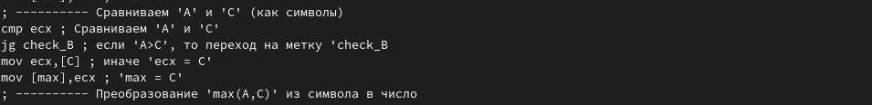{ #fig:013 width=70% }

Открываю файл листинга с помощью редактора mcedit и замечаю, что в файле листинга появляется ошибка. (рис. [-@fig:014]).

{ #fig:014 width=70% }Отсюда можно сделать вывод, что, если в коде появляется ошибка, то ее описание появится в файле листин

# Самостоятельная работа

Создаю файл lab7-3.asm с помощью утилиты touch (рис. [-@fig:016]).

{ #fig:016 width=70% }

Ввожу в созданный файл текст программы для вычисления наименьшего из 3 чисел. Числа беру, учитывая свой вариант из прошлой лабораторной работы. 5 вариант (рис. [-@fig:017]).

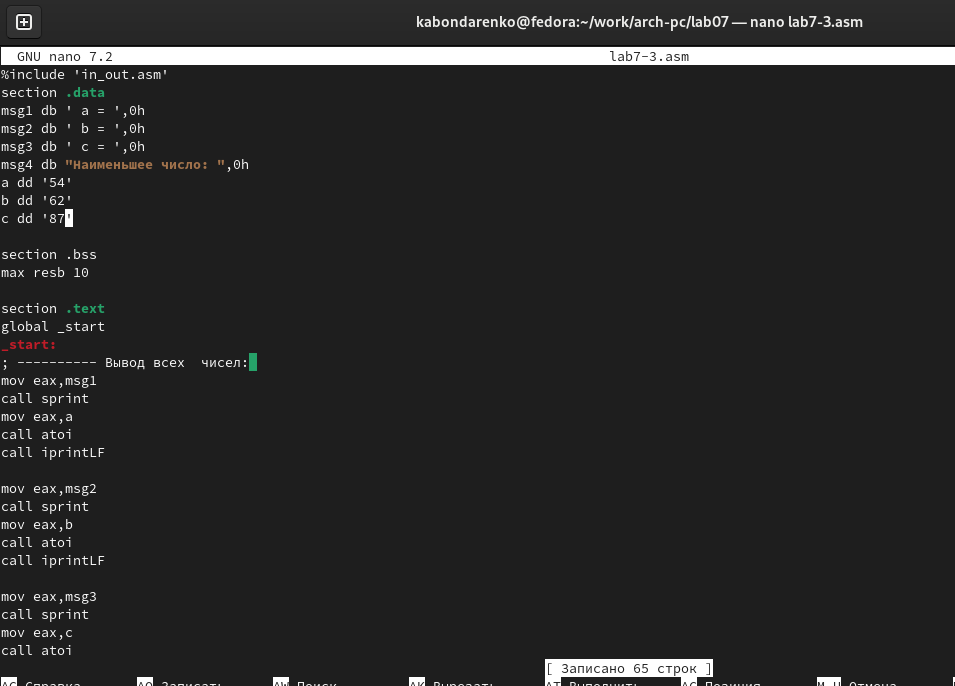{ #fig:017 width=70% }

Создаю исполняемый файл и запускаю его (рис. [-@fig:018]).

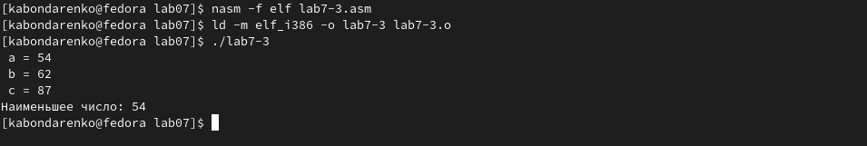{ #fig:018 width=70% }

**Текст программы**

```NASM
%include 'in_out.asm'
section .data
msg1 db ' а = ',0h
msg2 db ' b = ',0h
msg3 db ' c = ',0h
msg4 db "Наименьшее число: ",0h
a dd '54'
b dd '62'
c dd '87'

section .bss
max resb 10

section .text
global _start
_start:
; ---------- Вывод всех  чисел: 
mov eax,msg1
call sprint
mov eax,a
call atoi
call iprintLF

mov eax,msg2
call sprint
mov eax,b
call atoi
call iprintLF

mov eax,msg3
call sprint
mov eax,c
call atoi
call iprintLF

;-------------сравнивание чисел
mov eax,b
call atoi ;перевод символа в число
mov [b],eax ; запись преобразованного числа в b
;------------ запись b в переменную мах
mov ecx,[a] ;
mov [max],ecx ;
;------------сравнивание чисел a c
cmp ecx,[c]; if a>c
jl check_b ; то перход на метку
mov ecx,[c] ;
mov [max],ecx ;
;-------метка check_b
check_b:
mov eax,max ;
call atoi
mov [max],eax ;
;------------
mov ecx,[max] ;
cmp ecx,[b] ;
jl check_c ;
mov ecx,[b] ;
mov [max],ecx ;
;-------------
check_c:
mov eax,msg4 ;
call sprint ; 
mov eax,[max];
call iprintLF ;
call quit

```

Создаю новый файл lab7-4 и ввожу в него программу, которая выводит значения функции. Функцию беру из таблицы в соответствии со своим 5 вариантом (Вариант рис. [-@fig:019]). 

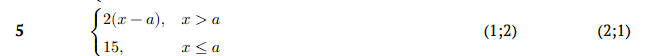{ #fig:021 width=70% }

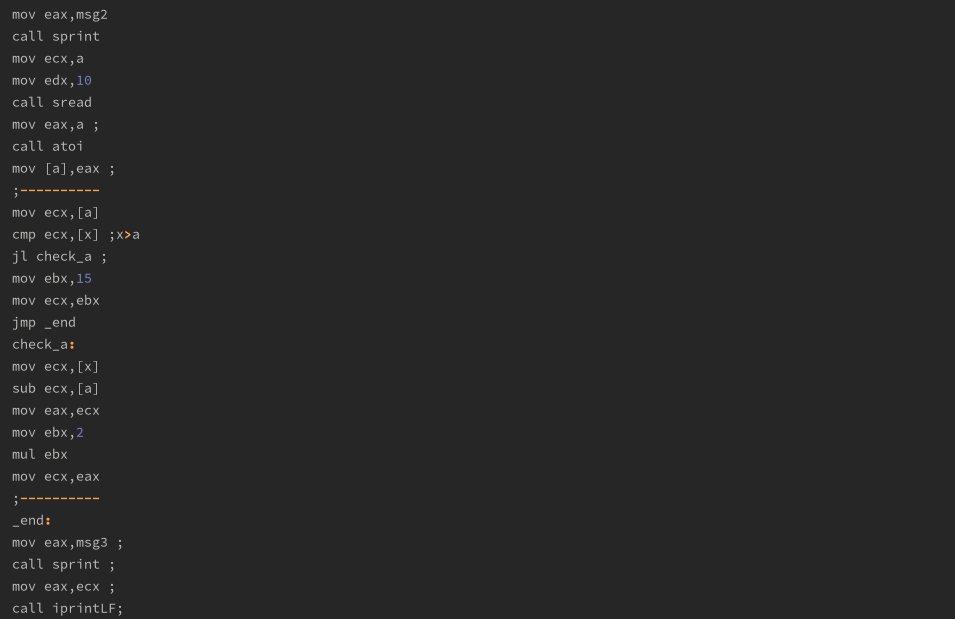{ #fig:019 width=70% }

Создаю испольняемый файл и проверяю её выполнение при (x=1, a=2) при (x=2 и a=1) (рис. [-@fig:020]).
Программа отработала верно!

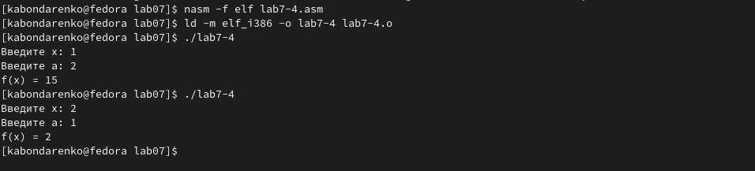{ #fig:020 width=70% }

**Текст программы**

```NASM
%include 'in_out.asm'
section .data
msg1 db 'Введите x: ',0h
msg2 db 'Введите a: ',0h
msg3 db 'f(x) = ',0h

section .bss
x resb 10
a resb 10

section .text
global _start
_start:
mov eax,msg1
call sprint
mov ecx,x
mov edx,10
call sread
mov eax,x
;----------
call atoi
mov [x],eax
;-----------

mov eax,msg2
call sprint
mov ecx,a
mov edx,10
call sread
mov eax,a ;
call atoi
mov [a],eax ;
;----------
mov ecx,[a]
cmp ecx,[x] ;x>a
jl check_a ;
mov ebx,15
mov ecx,ebx
jmp _end
check_a:
mov ecx,[x]
sub ecx,[a]
mov eax,ecx
mov ebx,2
mul ebx
mov ecx,eax
;----------
_end:
mov eax,msg3 ;
call sprint ;
mov eax,ecx ;
call iprintLF;
call quit ;
```

# Выводы

При выполнении данной лабораторной работы я освоила инструкции условного и безусловного вывода и ознакомилась с структурой файла листинга.
